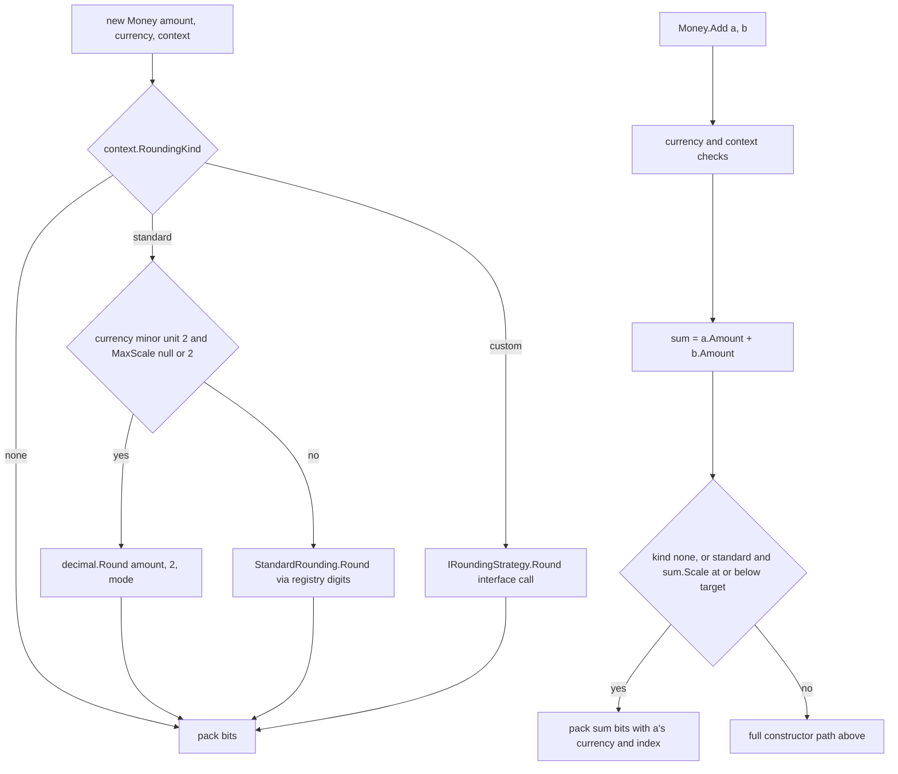
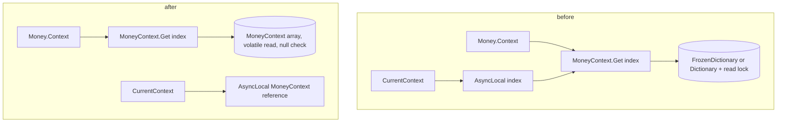

# Money Hot Path Performance - Plan

## Goal Capsule

- **Objective:** An application that constructs, adds, converts, formats or parses `Money` and `FastMoney` values spends measurably less time and memory per operation than with release 2.8, with every result, exception and rounding outcome unchanged except the two named defect fixes.
- **Means:** Remove the bookkeeping that the 2.8 Linux benchmark report shows dominating each hot path: registry lookups, type tests, redundant validation, per-call re-encoding and per-call allocations (KTD1 through KTD14).
- **Authority:** Requirements win on behavior. Key Technical Decisions win on mechanism inside those requirements. Units override neither.
- **Stop conditions:** Stop and ask before changing any public signature beyond sealing the two rounding records, before changing a rounding result for any currency, before adding a package reference, and before enabling unsafe code.
- **Execution profile:** Twelve units in four phases. Each unit lands with its tests green on the four Linux test legs and, where a benchmark exists, a number recorded for the report unit.

---

## Product Contract

### Summary

Rework the hot paths of `Money`, `FastMoney`, `MoneyContext`, `CurrencyInfo` and `CurrencyRegistry` so construction, arithmetic, integer and SqlMoney conversion, formatting and parsing stop paying for context registry lookups, rounding-strategy type tests, redundant validation, per-call currency re-encoding and per-call `NumberFormatInfo` clones. Fix the two defects the review exposed on the way. Measure against the 2.8 Linux report and publish a 2.9 report.

### Problem Frame

The 2.8 Linux benchmark report (`tests/Benchmark/PerformanceReportV2.8-linux.md`) shows `Money` construction from a code at 21.5 ns and `Money` addition at 20.7 ns, against 1.3 ns for `FastMoney` addition. Reading the code against those numbers attributes roughly half of each figure to work that is not arithmetic: a `FrozenDictionary<byte, MoneyContext>` lookup on every `Context` read (`src/NodaMoney/Context/MoneyContext.cs:261-278`), a type switch over unsealed rounding records that tests the uncommon `NoRounding` first (`src/NodaMoney/Money.cs:56-61`), a `Trace.Assert` that the SDK compiles into Release builds (`src/NodaMoney/Money.cs:42`), and a three-character re-encoding every time a `CurrencyInfo` converts to a `Currency` (`src/NodaMoney/CurrencyInfo.cs:241`).

Unary operations pay the same tax: `Negate` and `Increment` resolve the context object only to read back the index they already hold (`src/NodaMoney/Money.UnaryOperators.cs:57,93`). Integer conversion goes through the strategy interface, a registry lookup and `decimal.Round` for 28 ns where `FastMoney` does the same in 3.3 ns. `FastMoney` construction spends two decimal comparisons on a range check that `decimal.ToOACurrency` repeats. Formatting clones a `NumberFormatInfo` per call, which is most of its 384 B. Parsing allocates a string and an array per call to look up the currency symbol.

Two of the findings are defects rather than cost. `Money.Abs` rebuilds the value under the ambient context instead of the operand's (`src/NodaMoney/Money.NumericInterfaces.cs:38`). The `FastMoney` overflow handlers filter on the decimal overflow message, which a `long` overflow never produces, so the `FastMoney` message never appears (`src/NodaMoney/FastMoney.BinaryOperators.cs`, every `catch (OverflowException ex) when`).

### Key Decisions

- KD1. **The work list is the review's ranked findings, with its "leave alone" items excluded.** (session-settled: user-approved, chosen over re-surveying the code: the review already ranked the hot paths against the 2.8 numbers.) Governs R1 through R16, R20.
- KD2. **Seal `StandardRounding` and `NoRounding` and add a precomputed rounding kind on `MoneyContext`.** (session-settled: user-directed, chosen over the kind byte alone with the records left unsealed: nothing in the repo derives from either record and the seal is a two-line gain on top of the byte.) Governs R3, R18.
- KD3. **`Abs` preserving its operand's context and the `FastMoney` overflow message ship in this work. Fifth-based currency integer conversion stays as it is.** (session-settled: user-directed, chosen over shipping all three or none: the first two change no documented result, the third changes results for MRU and MGA.) Governs R17.
- KD4. **Add and Subtract skip re-rounding only. The direct 96-bit mantissa add is deferred.** (session-settled: user-directed, chosen over including the mantissa add: it needs a hand-written carry and sign path for a further few nanoseconds.) Governs R7.
- KD5. **The netstandard registries move to lock-free reads in this work.** (session-settled: user-directed, chosen over deferring: net48 and netstandard consumers pay a lock per lookup today.) Governs R16.
- KD6. **Formatting and parsing allocation work is in this plan.** (session-settled: user-directed, chosen over a follow-up plan.) Governs R12 through R15.
- KD7. **The 2.8 Linux report is the baseline the targets are measured against.** (session-settled: user-directed, chosen over re-running the suite on the current commit first.) Governs R21.
- KD8. **No unsafe code and no `SkipLocalsInit`.** (session-settled: user-directed, chosen over enabling `AllowUnsafeBlocks`: sub-nanosecond gain for an AOT-compatible financial library.) Governs R19.
- KD9. **The new report is `PerformanceReportV2.9-linux.md`.** (session-settled: user-directed, chosen over a 3.0 name: the 2.8.0 changelog already shipped a Breaking entry in a minor release.) Governs R21.
- KD10. **The 128-context ceiling gets no exhaustion test; only the unregistered-index miss path is tested.** (session-settled: user-directed, chosen over an isolated-process test: exhausting indices would poison the shared registry for every later test.) Governs R1.

### Requirements

**Hot-path bookkeeping**

- R1. Resolving a `MoneyContext` from an index is an array read on every target framework, and an unregistered index still raises `ArgumentException` with the existing message.
- R2. `Negate`, `Abs`, `IsNegative`, `IsPositive`, `Increment` and `Decrement` on `Money` never resolve the context object.
- R3. Hot paths select the rounding behavior from a value precomputed on the context, with no type test against `IRoundingStrategy` implementations.
- R4. No `Trace.Assert` remains in the `Money` or `FastMoney` constructors.
- R5. Converting a `CurrencyInfo` to a `Currency` does not re-encode the code on every call, and `with { Code = ... }` on a `CurrencyInfo` still defers validation to `Register`.
- R6. `MoneyContext.CurrentContext` costs one `AsyncLocal` read and no registry lookup when a thread context is set, and `Money(decimal)` evaluates it once.

**Arithmetic and conversion**

- R7. `Money` addition and subtraction skip re-rounding when the result's scale is within the context's target scale for the currency, and take the existing full path otherwise.
- R8. `Money.ToInt32` and `ToInt64` round on the integer mantissa when it fits in 64 bits, producing the same result as the decimal path for every `MidpointRounding` mode.
- R9. The `FastMoney` constructor validates the currency once and relies on `decimal.ToOACurrency` for the range check, still raising `ArgumentOutOfRangeException` out of range.
- R10. `FastMoney` multiplied or divided by a decimal computes in 64-bit fixed point when the intermediate fits, and falls back to the decimal path otherwise, with results identical to the decimal path.
- R11. `FastMoney` to and from `SqlMoney` uses the TDS ticks on net8 and later, with no decimal round trip.

**Formatting and parsing**

- R12. Formatting a `Money` does not clone a `NumberFormatInfo` per call, and two threads with different current cultures never observe each other's cached values.
- R13. `Money.TryFormat(Span<char>, ...)` with the currency-style specifiers allocates nothing.
- R14. Parsing a currency symbol or code allocates no string and no array on net9 and later.
- R15. `Money.TryParse` returns `false` without throwing and catching internally, and `Money.Parse` keeps its existing `FormatException` messages.

**Compatibility**

- R16. On the netstandard legs, currency and named-context lookups take no lock; only registration does.
- R17. Every public result, exception type and rounding outcome is unchanged, except that `Abs` returns a value in its operand's context and `FastMoney` overflow raises the `FastMoney` message.
- R18. `StandardRounding` and `NoRounding` are sealed, and the change is documented as breaking.
- R19. All five target frameworks build warning-free with no new package reference and no unsafe code.

**Measurement**

- R20. The benchmark project gains a construction case that needs a real round, a mixed-scale addition case, and TDS conversion cases for `FastMoney`.
- R21. `tests/Benchmark/PerformanceReportV2.9-linux.md` records the post-change run in the 2.8 file's layout.

### Success Criteria

Measured on the same machine that produced the 2.8 report, per KD7. Targets are ceilings; the 2.8 figure is the value to beat.

| Benchmark (class.method) | 2.8 Linux | Target |
|---|---|---|
| InitializingMoney.CurrencyCode | 21.5 ns | 14 ns |
| InitializingMoney.ImplicitCurrencyByConstructor | 58.1 ns, 32 B | 25 ns, 0 B |
| MoneyOperations.Add / Subtract | 20.7 / 20.1 ns | 10 ns |
| MoneyOperations.Increment / Decrement | 9.6 ns | 5 ns |
| MoneyConversion.ToIn32 / ToInt64 | 28.4 / 28.1 ns | 6 ns |
| InitializingMoney.fCurrencyCode | 22.9 ns | 15 ns |
| MoneyOperations.fMultipleDec | 15.8 ns | 6 ns |
| MoneyOperations.fDivideDec | 50.6 ns | 12 ns |
| MoneyConversion.fToSqlMoney | 13.0 ns | 1 ns |
| MoneyFormatting.DefaultFormat | 87.9 ns, 384 B | 60 ns, 100 B |
| MoneyParsing.Implicit | 101.7 ns, 160 B | 90 ns, 64 B |

### Scope Boundaries

- Rounding results, exception types and messages stay as in 2.8 except where R17 names a change.
- No new public API surface. New constructors, caches and helpers are internal.
- The public `IRoundingStrategy` extension point keeps working; a custom strategy always takes the full construction path.

#### Deferred to Follow-Up Work

- Direct 96-bit mantissa addition for same-scale, same-sign operands (KD4).
- `ToInt32` / `ToInt64` for `MinorUnit.OneFifth` currencies round via scale-up and scale-down to multiples of 0.2 and then truncate (KD3). Pre-existing.
- `with { Currency = ... }` on `Money` swaps the code without re-rounding to the new currency's digits. Pre-existing, untested.
- `Increment` and `Decrement` step by the stored scale rather than the context's target scale, so a value re-labeled to a narrower context steps by the wrong unit. Pre-existing.
- `Money.Precision` goes through `SqlDecimal`. Internal, not on a hot path.
- Reinterpreting `Money` bits as a `decimal` without `GetBits` (layout-dependent, marginal, and KD8 rules out the unsafe route).
- The 128-context ceiling exhaustion test (KD10).

### Sources

- `tests/Benchmark/PerformanceReportV2.8-linux.md`: the baseline numbers above.
- `AGENTS.md`: the bit-packing contract, the 128-context limit, the netstandard shim policy, the warning-free build rule and the test-leg matrix.
- `CHANGELOG.md:31`: the precedent for a `**Breaking**:` bullet inside a minor release.
- Framework reference packs in the local NuGet cache: `SqlMoney.FromTdsValue` and `GetTdsValue` exist from net8.0; `FrozenDictionary.GetAlternateLookup` from net9.0; `Math.BigMul(long, long, out long)` from net5.0; `decimal.IsInteger` from net7.0. None exist on netstandard2.0 or 2.1.

---

## Planning Contract

### Key Technical Decisions

- KTD1. **The context registry is a `MoneyContext?[128]` array published with a volatile write, on every target framework.** Indices are dense, assigned once and never reclaimed (`src/NodaMoney/Context/MoneyContextIndex.cs`), so a dictionary buys nothing. The lookup keeps its explicit null check and throws the existing `ArgumentException`; a bare index would turn a miss into a `NullReferenceException` with no message. Registration stays under the existing lock, which is also what keeps the index counter safe.
- KTD2. **`MoneyContext` precomputes a rounding kind (none, standard, custom) and the `MidpointRounding` mode at construction, and both rounding records are sealed.** Hot paths switch on the kind byte; the interface call remains only for the custom kind. Sealing makes any remaining type test a single method-table compare. (session-settled: user-directed, chosen over the kind byte alone: nothing derives from the records, see KD2.)
- KTD3. **The internal `Money` constructor takes the context index, not the context object, and sign changes edit the flags word.** `Negate` flips the sign bit, `Abs` clears it, `IsNegative` and `IsPositive` test it together with the zero check. `Increment` and `Decrement` keep their decimal add but pass the index they already hold. `Abs` keeping the operand's context is the KD3 fix.
- KTD4. **`CurrencyInfo` caches its encoded `Currency` lazily inside an equality-neutral holder, and never validates in an init setter.** `CurrencyInfo` is a record with compiler-generated equality, so a plain cache field would make two structurally equal instances compare unequal once only one of them had been converted. The cache therefore lives in a private nested holder class whose `Equals` always returns true and whose `GetHashCode` is constant, referenced from one field; record equality and hashing are unaffected. The `Code` and `MinorUnit` init setters replace the holder with a fresh empty one, so a `with` that changes either gets its own cache while a `with` that changes anything else shares the still-valid one. A `ConditionalWeakTable` side table was rejected: its lookup costs more than the re-encoding it would replace. Two existing tests require `with { Code = null! }` and `with { Code = "Abc" }` to succeed and fail only at `Register` (`tests/NodaMoney.Tests/CurrencyInfoSpec/RegisterCurrencyInfo.cs:216,235`); an eager cache would throw there.
- KTD5. **The thread context `AsyncLocal` holds the `MoneyContext` reference.** One read, no registry lookup, no boxed nullable index. `CreateScope` and `ThreadContext` keep their signatures.
- KTD6. **Addition and subtraction skip rounding when the result decimal's scale is at or below the target scale, where target is `MaxScale` if set, otherwise 2 for a currency carrying the minor-unit-2 flag, otherwise the registry's decimal digits.** The check is on the result, after the decimal operation. A value re-labeled to a narrower context via `with { Context = ... }` carries a scale above target (documented in `CHANGELOG.md` for 2.8.0); its sum then has that scale too, fails the check, and takes the full path exactly as today. The none kind always skips; the custom kind never skips, because a custom strategy is not closed under addition in general. `decimal` addition never raises the scale above the larger operand's, so the rule is safe for standard rounding.
- KTD7. **Integer conversion rounds on the 64-bit mantissa when the high word is zero and the scale is at most 18, mirroring `FastMoney`'s existing tie handling.** Otherwise the existing decimal path runs. The fast path applies to the standard kind only.
- KTD8. **The `FastMoney` constructor lets `decimal.ToOACurrency` detect out-of-range input and translates its `OverflowException` into the existing `ArgumentOutOfRangeException`.** The two decimal comparisons go. The currency is validated once: the `Currency` property moves from a `field`-keyword auto-property to an explicit private field at the same `FieldOffset(8)`, the init accessor keeps validating and writes that field, and the constructor assigns the field directly after its own validation. Every `FastMoney` overflow handler drops its message filter so a `long` overflow reaches the `FastMoney` message (KD3).
- KTD9. **`FastMoney` times or divided by a decimal uses `Math.BigMul` on the multiplier's mantissa and a 64-bit divide by the power of ten, with ToEven ties, when the 128-bit product's high word is only sign extension and the mantissa's high word is zero.** Anything else, including the netstandard legs where the three-argument `BigMul` does not exist, takes today's decimal path.
- KTD10. **Formatting caches a read-only `NumberFormatInfo` per `CurrencyInfo` instance in a `ConditionalWeakTable`, keyed by the resolved culture name plus the two symbol flags.** The default branch resolves `CultureInfo.CurrentCulture` at call time and keys on it, so two threads with different cultures get different entries. An explicit `NumberFormatInfo` provider keys on its own reference. Cached instances are made read-only after the symbol, digits and pattern edits. `TryFormat(Span<char>, ...)` for the currency-style specifiers writes through `decimal.TryFormat` with the cached info and a stack-built format; the other specifiers keep the string path.
- KTD11. **Parsing looks symbols up in a `FrozenDictionary<string, CurrencyInfo[]>` with the span alternate lookup on net9 and later, and returns the stored array without copying.** Lookups use try-get semantics, because the current `ILookup` indexer returns empty on a miss and a throwing indexer would surface `KeyNotFoundException` instead of the `FormatException` at `src/NodaMoney/Money.Parsable.cs:184`. `ParseCurrencyInfo` gains an internal non-throwing variant that reports which of the four failure classes occurred; `Parse` maps them to the existing messages and `TryParse` to `false`.
- KTD12. **The netstandard registries keep an immutable dictionary reference that writers replace under the lock and readers read with a volatile load.** Same shape the net8 legs already use with `FrozenDictionary`, without the frozen type. Applies to the code and currency maps in `src/NodaMoney/CurrencyRegistry.cs` and the named-context map in `src/NodaMoney/Context/MoneyContext.cs`.
- KTD13. **`FastMoney` to `SqlMoney` is `SqlMoney.FromTdsValue` on the stored ticks, and back is `GetTdsValue`, under a net8 guard.** Both are scaled by ten thousand, the same as OA currency.
- KTD14. **`CurrencyInfo.CurrentCurrency` keeps a single-entry cache keyed on the `CultureInfo.CurrentCulture` reference.** A hit skips the `RegionInfo` allocation; a miss takes the existing path and replaces the entry.
- KTD15. **New benchmarks are added to the existing classes, not new classes.** A construction case with three decimals in `InitializingMoneyBenchmarks`, a mixed-scale add in `MoneyOperationsBenchmarks`, and TDS cases next to `fToSqlMoney` in `MoneyConvertingBenchmarks`, so the report keeps its category layout.

### High-Level Technical Design

Hot-path dispatch after the change. The construction gate replaces the type switch; the addition gate is new.

Context resolution before and after. The array replaces both the frozen dictionary on net8+ and the reader lock on netstandard.

### Assumptions

- Benchmarks run on the machine that produced the 2.8 report, or the comparison notes the hardware difference in the 2.9 report header.
- `decimal.ToOACurrency` raises `OverflowException` for out-of-range input on the .NET Framework leg as it does on CoreCLR. Unit U7 pins the boundary so a CI run on Windows would catch a difference.

### Sequencing

Phase 1 (U1 to U4) touches every later unit's hot path and has no behavior change beyond the `Abs` fix, so it lands first. Phase 2 (U5 to U8) builds on the kind byte and index constructor. Phase 3 (U9 to U11) is independent of phase 2: U9 and U10 depend on nothing and can start at any time, and U11 can start once U1 has landed. Phase 4 (U12) runs last because it measures everything.

---

## Implementation Units

| U-ID | Title | Key files | Depends on |
|---|---|---|---|
| U1 | Array-backed context registry and reference-typed thread context | `src/NodaMoney/Context/MoneyContext.cs` | none |
| U2 | Rounding kind on the context, sealed records, no Trace.Assert | `src/NodaMoney/Context/MoneyContext.cs`, `StandardRounding.cs`, `NoRounding.cs`, `src/NodaMoney/Money.cs`, `FastMoney.cs` | U1 |
| U3 | Index-based internal constructor and flag-word unary operations | `src/NodaMoney/Money.cs`, `Money.UnaryOperators.cs`, `Money.NumericInterfaces.cs` | U1 |
| U4 | Cached currency encoding and cheaper implicit-currency construction | `src/NodaMoney/CurrencyInfo.cs`, `Money.Constructors.cs`, `FastMoney.Constructors.cs` | none |
| U5 | Skip re-rounding in Money addition and subtraction | `src/NodaMoney/Money.BinaryOperators.cs` | U2, U3 |
| U6 | Integer fast path for Money.ToInt32 and ToInt64 | `src/NodaMoney/Money.Convertible.cs` | U2 |
| U7 | FastMoney constructor validation and overflow messages | `src/NodaMoney/FastMoney.cs`, `FastMoney.BinaryOperators.cs`, `FastMoney.UnaryOperators.cs` | U2 |
| U8 | FastMoney fixed-point decimal arithmetic and TDS SqlMoney conversion | `src/NodaMoney/FastMoney.BinaryOperators.cs`, `FastMoney.Convertible.cs` | U7 |
| U9 | Cached NumberFormatInfo and allocation-free TryFormat | `src/NodaMoney/CurrencyInfo.cs`, `Money.Formattable.cs` | none |
| U10 | Allocation-free symbol lookup and exception-free TryParse | `src/NodaMoney/CurrencyRegistry.cs`, `Money.Parsable.cs` | none |
| U11 | Lock-free reads on the netstandard registries | `src/NodaMoney/CurrencyRegistry.cs`, `src/NodaMoney/Context/MoneyContext.cs` | U1 |
| U12 | Benchmarks, 2.9 report and changelog | `tests/Benchmark/*Benchmarks.cs`, `tests/Benchmark/PerformanceReportV2.9-linux.md`, `CHANGELOG.md` | U1 to U11 |

### Phase 1: Context and construction bookkeeping

### U1. Array-backed context registry and reference-typed thread context

- **Goal:** Every context resolution is an array read, and the thread-local context is one `AsyncLocal` read.
- **Requirements:** R1, R6.
- **Dependencies:** none.
- **Files:** `src/NodaMoney/Context/MoneyContext.cs`; tests in `tests/NodaMoney.Tests/MoneyContextSpec/CreateContext.cs` and a new `tests/NodaMoney.Tests/MoneyContextSpec/ResolveContext.cs`.
- **Approach:** KTD1 and KTD5.
  1. Replace the active-context map with the array on all target frameworks; keep the named-context map as it is for U11.
  2. Registration writes the slot under the existing lock after the equivalence scan; the index counter stays behind that lock.
  3. `Get` reads the slot with a volatile load and throws the existing `ArgumentException` on null.
  4. Store the context reference in the `AsyncLocal`; `ThreadContext`, `CurrentContext` and `CreateScope` keep their public shape.
- **Patterns to follow:** The existing `lock (s_lock)` registration block; `[Collection(nameof(NoParallelization))]` on any registry test, as `CreateContext.cs:6` does.
- **Test scenarios:**
  - Creating a context with new options returns an instance whose index resolves back to the same instance.
  - Creating a context with options equal to an existing one returns the existing instance and consumes no index.
  - Resolving an index that was never registered throws `ArgumentException` with the existing "Invalid MoneyContext index" message, not `NullReferenceException` (internal access via `InternalsVisibleTo`).
  - Setting `ThreadContext`, reading `CurrentContext` inside and after a `CreateScope`, and setting `ThreadContext` to null all behave as the existing `SetThreadContext` and `UseScopeWithGivenContext` tests expect.
  - `CurrentContext` observed from a continuation after `await` inside a scope is the scoped context.
- **Verification:** Existing `MoneyContextSpec` tests pass unchanged; the new miss-path test passes; no `FrozenDictionary<byte, ...>` remains in the file.

### U2. Rounding kind on the context, sealed records, no Trace.Assert

- **Goal:** Construction and `Amount` initialization select rounding from a byte, and Release builds carry no assert call in the constructors.
- **Requirements:** R3, R4, R18.
- **Dependencies:** U1.
- **Files:** `src/NodaMoney/Context/MoneyContext.cs`, `src/NodaMoney/Context/StandardRounding.cs`, `src/NodaMoney/Context/NoRounding.cs`, `src/NodaMoney/Money.cs`, `src/NodaMoney/FastMoney.cs`, `src/NodaMoney/FastMoney.Convertible.cs`; tests in `tests/NodaMoney.Tests/MoneyRoundingSpec/ApplyStandardRounding.cs`, `ApplyMaxScale.cs`, and `tests/NodaMoney.Tests/MoneySpec/CreateMoneyWithDifferentRounding.cs`.
- **Approach:** KTD2.
  1. Seal both records.
  2. Compute the kind and mode in the `MoneyContext` constructor from the options' strategy type.
  3. Replace the three type switches (`Money` constructor, `Amount` init accessor, `FastMoney` constructor) and the `is StandardRounding` test in `FastMoney`'s integer rounding helper with a switch on the kind, keeping the existing minor-unit-2 fast path inside the standard branch.
  4. Replace `Trace.Assert` with `Debug.Assert` in both constructors.
- **Patterns to follow:** The existing minor-unit-2 fast path in `StandardRounding.Round(decimal, Currency, int?)`.
- **Test scenarios:**
  - Constructing with each of the five `MidpointRounding` modes and a three-decimal EUR amount rounds exactly as today (existing `ApplyStandardRounding` cases).
  - Constructing under the no-rounding context keeps all decimals.
  - Constructing under a context with a custom `IRoundingStrategy` (a test fake; check `tests/NodaMoney.Tests/Helpers` first, add one if absent) calls the strategy and stores its result.
  - `with { Amount = ... }` under each kind rounds the same way as construction.
  - `FastMoney` under a custom strategy calls it; under ToEven with max scale 4 it skips the strategy and relies on `ToOACurrency`.
- **Verification:** `MoneyRoundingSpec`, `MoneySpec` and `FastMoneySpec` pass; no `is StandardRounding` or `is NoRounding` remains in `src/`; both records are sealed.

### U3. Index-based internal constructor and flag-word unary operations

- **Goal:** Sign and step operations on `Money` never touch the registry, and `Abs` keeps its operand's context.
- **Requirements:** R2, R17.
- **Dependencies:** U1.
- **Files:** `src/NodaMoney/Money.cs`, `src/NodaMoney/Money.UnaryOperators.cs`, `src/NodaMoney/Money.NumericInterfaces.cs`; tests in `tests/NodaMoney.Tests/MoneyUnaryOperatorsSpec/AddAndSubtractMoneyUnary.cs`, `IncrementAndDecrementMoneyUnary.cs`, and a new `tests/NodaMoney.Tests/MoneyNumericInterfaces/AbsoluteValueAndSign.cs`.
- **Approach:** KTD3.
  1. Change the internal constructor to take the index; add a private constructor over the raw flags word and three mantissa words.
  2. `Negate` flips the sign bit unless the magnitude is zero; `Abs` clears it; `IsNegative` and `IsPositive` become bit tests with the zero rule unchanged.
  3. `AdjustByMinorUnit` passes the index from the flags instead of resolving the context.
- **Patterns to follow:** The existing zero fast path at the top of `Negate`.
- **Test scenarios:**
  - Negating 10.50 EUR gives minus 10.50 EUR with the same scale and context index.
  - Negating zero returns zero with the sign bit clear.
  - `Abs` of minus 10.50 EUR built under a non-default context, evaluated while a different context is current, returns 10.50 EUR whose `Context` equals the operand's context.
  - `Abs` of a positive value and of zero return equal values.
  - `IsNegative` is false for zero and for positive, true for negative; `IsPositive` is true for zero and positive.
  - `MinMagnitude` and `MaxMagnitude` on operands with different contexts do not throw and return the selected operand unchanged.
  - Increment and decrement on 765.43 EUR step by 0.01 and keep the context (existing theory data).
- **Verification:** All `MoneyUnaryOperatorsSpec` tests pass; the new `Abs` context test fails before the change and passes after; `money.Context` no longer appears in the unary or numeric-interface files.

### U4. Cached currency encoding and cheaper implicit-currency construction

- **Goal:** Converting a `CurrencyInfo` to a `Currency` and constructing with the culture's currency stop re-encoding and allocating.
- **Requirements:** R5, R6.
- **Dependencies:** none.
- **Files:** `src/NodaMoney/CurrencyInfo.cs`, `src/NodaMoney/Money.Constructors.cs`, `src/NodaMoney/FastMoney.Constructors.cs`; tests in `tests/NodaMoney.Tests/CurrencyInfoSpec/RegisterCurrencyInfo.cs`, `CurrentCurrency.cs`, a new `tests/NodaMoney.Tests/CurrencyInfoSpec/ConvertToCurrency.cs`, and `tests/NodaMoney.Tests/MoneySpec/MoneyImplicit.cs`.
- **Approach:** KTD4 and KTD14.
  1. Add the equality-neutral cache holder to `CurrencyInfo` per KTD4; the `Code` and `MinorUnit` init accessors replace it with a fresh holder; the implicit operator fills it on first use.
  2. `Money(decimal)` and `FastMoney(decimal)` read `CurrentContext` once and pass it through.
  3. `CurrentCurrency` keeps a single cached pair of current-culture reference and resolved `CurrencyInfo`.
- **Patterns to follow:** `Currency`'s span constructor stays the single place that validates a code.
- **Test scenarios:**
  - `CurrencyInfo.FromCode("EUR")` converted twice yields equal `Currency` values with the minor-unit-2 flag set.
  - Two independently constructed, structurally equal `CurrencyInfo` instances, one of them already converted to a `Currency` and the other not, are equal and have the same hash code.
  - `euro with { Code = "USD" }` converts to a `Currency` encoding USD, not EUR.
  - `euro with { MinorUnit = MinorUnit.Zero }` converts to a `Currency` without the minor-unit-2 flag.
  - `euro with { Code = null! }` and `euro with { Code = "Abc" }` construct without throwing and fail at `Register` (existing tests, must stay green).
  - `CurrentCurrency` under nl-NL returns EUR, then under en-US returns USD, then under nl-NL again returns EUR.
  - `new Money(6.54m)` under a context with a default currency uses that currency and that context.
- **Verification:** `CurrencyInfoSpec` and `MoneySpec` pass; the `InitializingCurrency.CurrencyFromCode` and `ImplicitCurrencyByConstructor` benchmarks drop (recorded in U12).

### Phase 2: Arithmetic and conversion

### U5. Skip re-rounding in Money addition and subtraction

- **Goal:** Same-context addition and subtraction of already-rounded values build the result from the sum's bits.
- **Requirements:** R7, R17.
- **Dependencies:** U2, U3.
- **Files:** `src/NodaMoney/Money.BinaryOperators.cs`; tests in `tests/NodaMoney.Tests/MoneyBinaryOperatorsSpec/AddAndSubtractMoney.cs` and `tests/NodaMoney.Tests/MoneyRoundingSpec/MoneyCalculations.cs`.
- **Approach:** KTD6. Apply the gate in `Add(Money, Money)` and `Subtract(Money, Money)` after the existing currency and context checks and the checked decimal operation. The decimal overloads, `Multiply`, `Divide` and `Remainder` keep the full path but benefit from U1 and U2.
- **Test scenarios:**
  - 10.00 EUR plus 20.00 EUR gives 30.00 EUR with scale 2 and the operands' context.
  - 10.5 EUR plus 20.25 EUR (scales 1 and 2) gives 30.75 EUR.
  - Under a context with max scale 4, 1.2345 EUR plus 1.0001 EUR gives 2.2346 EUR without rounding.
  - A value re-labeled with `with { Context = maxScaleZero }` still carrying 10.55 plus 1.00 in that context gives 12 (rounded to zero decimals) exactly as before the change, because the sum's scale exceeds the target.
  - Under a custom strategy context, addition still calls the strategy (fake records the call).
  - Under the no-rounding context, 0.005 EUR plus 0.005 EUR gives 0.010 EUR.
  - Adding `MaxValue` to one EUR still raises `OverflowException` with the "Money" message.
  - Subtraction mirrors each addition case.
  - Zero-operand fast paths return the other operand unchanged (existing tests).
- **Verification:** `MoneyBinaryOperatorsSpec` and `MoneyRoundingSpec` pass; the `MoneyOperations.Add` and `Subtract` benchmarks meet the success-criteria target in U12.

### U6. Integer fast path for Money.ToInt32 and ToInt64

- **Goal:** Integer conversion rounds on the mantissa for the common case.
- **Requirements:** R8.
- **Dependencies:** U2.
- **Files:** `src/NodaMoney/Money.Convertible.cs`; tests in `tests/NodaMoney.Tests/MoneyConvertibleSpec/ConvertMoneyToNumericType.cs` and `ExplicitCastMoneyToNumericType.cs`.
- **Approach:** KTD7. Port the tie logic from `FastMoney.Convertible.cs`'s integer rounding helper, generalized over a power-of-ten table for scales 0 to 18; fall through to the existing decimal path for the high word set, scale above 18, or a non-standard kind.
- **Test scenarios:**
  - 765.43 EUR to int gives 765; 765.50 gives 766 under ToEven (766 is even); 764.50 gives 764.
  - Minus 2.5 gives minus 2 under ToEven and minus 3 under AwayFromZero.
  - 2.5 under ToZero gives 2, ToNegativeInfinity gives 2, ToPositiveInfinity gives 3; minus 2.5 gives minus 2, minus 3, minus 2 respectively.
  - A value above `int.MaxValue` to int throws `OverflowException`; to long succeeds.
  - A value whose mantissa exceeds 64 bits (for example 1e20 with scale 0 under no rounding) takes the decimal path and matches it.
  - A value with scale above 18 under no rounding matches the decimal path.
  - Under a custom strategy the strategy is called with zero decimals.
- **Verification:** `MoneyConvertibleSpec` passes; `MoneyConversion.ToIn32` and `ToInt64` benchmarks meet the target in U12.

### U7. FastMoney constructor validation and overflow messages

- **Goal:** The `FastMoney` constructor does no work that `ToOACurrency` repeats, and overflow reports the `FastMoney` message.
- **Requirements:** R9, R17.
- **Dependencies:** U2.
- **Files:** `src/NodaMoney/FastMoney.cs`, `src/NodaMoney/FastMoney.BinaryOperators.cs`, `src/NodaMoney/FastMoney.UnaryOperators.cs`; tests in `tests/NodaMoney.Tests/FastMoneySpec/CreateFastMoneyWithMinAndMaxValues.cs`, `CreateFastMoney.cs`, and a new folder `tests/NodaMoney.Tests/FastMoneyBinaryOperatorsSpec/AddAndSubtractFastMoney.cs`.
- **Approach:** KTD8.
  1. Remove the two decimal range comparisons; wrap `ToOACurrency` and rethrow `ArgumentOutOfRangeException` with the existing parameter name and message.
  2. Convert the `Currency` property to an explicit private field at `FieldOffset(8)` per KTD8; the constructor assigns it after the single validation; `with { Currency = ... }` keeps validating through the init accessor.
  3. Drop the `when (ex.Message == ...)` filters on every overflow handler in the binary and unary operator files.
- **Patterns to follow:** The existing `ValidateContext` helper for the explicit-context branch.
- **Test scenarios:**
  - `decimal.MaxValue` and `decimal.MinValue` throw `ArgumentOutOfRangeException` (existing tests, tightened from `ArgumentException`).
  - The exact `MaxValueLong` and `MinValueLong` amounts construct; one ten-thousandth beyond each throws `ArgumentOutOfRangeException`.
  - Constructing with JPY validates once and succeeds; constructing with a currency of five decimals throws `InvalidCurrencyException`.
  - `with { Currency = fiveDecimalCurrency }` still throws `InvalidCurrencyException`.
  - Adding `FastMoney.MaxValue` to one EUR throws `OverflowException` whose message names `FastMoney`; the inner exception is the arithmetic overflow.
  - Multiplying `MaxValue` by 2 and incrementing `MaxValue` raise the same `FastMoney` message.
- **Verification:** `FastMoneySpec` passes; the new binary-operator spec passes; `InitializingMoney.fCurrencyCode` meets its target in U12.

### U8. FastMoney fixed-point decimal arithmetic and TDS SqlMoney conversion

- **Goal:** `FastMoney` times or divided by a decimal, and `SqlMoney` conversion, avoid the decimal round trip when the value fits.
- **Requirements:** R10, R11.
- **Dependencies:** U7.
- **Files:** `src/NodaMoney/FastMoney.BinaryOperators.cs`, `src/NodaMoney/FastMoney.Convertible.cs`; tests in `tests/NodaMoney.Tests/FastMoneyBinaryOperatorsSpec/MultiplyAndDivideFastMoney.cs` (new) and `tests/NodaMoney.Tests/FastMoneyConvertibleSpec/ConvertFastMoneyToSqlMoney.cs` (new).
- **Approach:** KTD9 and KTD13.
  1. Extract the multiplier's mantissa, scale and sign with `decimal.GetBits`; when the high word is zero, compute the 128-bit product with `Math.BigMul` and divide by the scale's power of ten with a ToEven tie on the remainder; otherwise call the existing decimal path.
  2. Division mirrors it with the ticks scaled up by the divisor's power of ten before the 64-bit divide; a zero divisor takes the decimal path so the exception stays `DivideByZeroException`.
  3. Guard the fixed-point paths with `NET5_0_OR_GREATER`; the netstandard legs keep the decimal path.
  4. `ToSqlMoney` and both `FromSqlMoney` overloads use the TDS value under `NET8_0_OR_GREATER`.
- **Patterns to follow:** The existing integer-multiplier branch in `Multiply(FastMoney, decimal)` and the tie handling in the integer rounding helper.
- **Test scenarios:**
  - 10 EUR times 2.2 gives 22 EUR; 10 EUR divided by 2.2 gives 4.5455 EUR (ToEven at four decimals), both equal to the decimal path.
  - Negative times negative and negative divided by negative give positive results equal to the decimal path.
  - 0.00005 times 1 (a tie at the fifth decimal) rounds to even, matching `ToOACurrency`.
  - A multiplier with a mantissa above 64 bits (for example 12345678901234567890.5m) takes the decimal path and matches it.
  - A divisor with more than 18 decimals takes the decimal path and matches it.
  - A product that overflows `long` throws `OverflowException` with the `FastMoney` message.
  - Dividing by 0m throws `DivideByZeroException`, as today.
  - 765.43 EUR to `SqlMoney` equals `new SqlMoney(765.43m)`; converting back gives 765.43 EUR; `SqlMoney.Null` converts to null.
- **Verification:** The two new specs pass on net8, net9 and net10; the netstandard leg (net6.0 test target) passes with the decimal path; `fMultipleDec`, `fDivideDec` and `fToSqlMoney` meet their targets in U12.

### Phase 3: Formatting, parsing and netstandard

### U9. Cached NumberFormatInfo and allocation-free TryFormat

- **Goal:** Formatting stops cloning per call and span formatting stops allocating for the currency-style specifiers.
- **Requirements:** R12, R13.
- **Dependencies:** none.
- **Files:** `src/NodaMoney/CurrencyInfo.cs`, `src/NodaMoney/Money.Formattable.cs`; tests in `tests/NodaMoney.Tests/MoneyFormattableSpec/TryFormat.cs`, `DefaultFormat.cs`, `FormatWithCurrencySymbol.cs`, `FormatWithCurrencyCode.cs`, and a new `tests/NodaMoney.Tests/MoneyFormattableSpec/FormatCacheIsolation.cs`.
- **Approach:** KTD10.
  1. Replace the per-call clone in `ToNumberFormatInfo` with the keyed cache; build the entry once, apply the existing symbol, digit and pattern edits, mark it read-only.
  2. Route `TryFormat(Span<char>, ...)` for the `C`, `G`, `I`, `N` and `F` specifiers through `decimal.TryFormat`; keep the string path for compact, name and round-trip specifiers.
  3. Replace the `$"C{digits}"` interpolations with a static table of the ten format strings.
- **Patterns to follow:** The existing `ParseFormatSpecifier` for the specifier and digit split.
- **Test scenarios:**
  - All existing `MoneyFormattableSpec` outputs are byte-identical.
  - Formatting the same `Money` twice returns equal strings and the second call performs no `NumberFormatInfo` allocation (assert via a repeated-call allocation check or by inspecting that the cached instance is reused).
  - Formatting EUR under nl-NL then en-US then nl-NL yields the culture-correct string each time.
  - Two tasks with different current cultures formatting the same currency concurrently each get their own culture's output.
  - An explicit `NumberFormatInfo` provider and a `CultureInfo` provider each produce today's output.
  - `TryFormat` into a sufficient buffer with `"C"`, `"C0"`, `"G"`, `"N2"` and `"F"` writes today's characters and reports the length; an insufficient buffer returns false with zero written.
  - `TryFormat` with the compact specifier still succeeds through the string path.
  - The cached instance is read-only: mutating it throws `InvalidOperationException`.
- **Verification:** `MoneyFormattableSpec` passes; `MoneyFormatting.DefaultFormat` meets its allocation and time target in U12.

### U10. Allocation-free symbol lookup and exception-free TryParse

- **Goal:** Parsing looks up the currency without allocating and reports failure without an internal throw.
- **Requirements:** R14, R15.
- **Dependencies:** none.
- **Files:** `src/NodaMoney/CurrencyRegistry.cs`, `src/NodaMoney/Money.Parsable.cs`; tests in `tests/NodaMoney.Tests/MoneyParsableSpec/TryParseImplicitCurrency.cs`, `TryParseExplicitCurrency.cs`, `ParseAllCurrencySymbolsAndCodes.cs`.
- **Approach:** KTD11.
  1. Build the code-and-symbol map as a frozen dictionary of arrays on net8+ and a plain dictionary on netstandard; on net9+ take the span alternate lookup once at construction.
  2. `GetAllCurrencies(ReadOnlySpan<char>)` returns the stored array through try-get; a miss returns an empty array.
  3. Split `ParseCurrencyInfo` into a non-throwing core that returns the matched info or a failure class (unknown, ambiguous, mismatch with provided, ambiguous with provided); `Parse` throws the existing messages; `TryParse` returns false. The `FormatException` catch in `TryParse` goes.
- **Patterns to follow:** The existing `TryGet(string, out CurrencyInfo)` shape in `CurrencyRegistry`.
- **Test scenarios:**
  - Every existing parse and try-parse case is unchanged (`ParseAllCurrencySymbolsAndCodes` is the broad net).
  - `Parse("XYZ 1.00")` throws `FormatException` with the existing unknown-symbol message.
  - `Parse("¥ 1.00")` under nl-NL throws the ambiguous-symbol message; with a JPY provider returns yen; with an EUR provider throws the mismatch message.
  - `TryParse` on each of those inputs returns false with a zero no-currency result and raises no first-chance exception (assert with an `AppDomain.FirstChanceException` counter or equivalent).
  - `TryParse("  ")` and `TryParse(null)` return false as today.
  - Registering a custom currency after first parse is found by symbol (the map rebuilds on `TryAdd`).
- **Verification:** `MoneyParsableSpec` and `CurrencyInfoSpec` pass on all legs; `MoneyParsing.Implicit` meets its target in U12.

### U11. Lock-free reads on the netstandard registries

- **Goal:** Currency and named-context lookups on the netstandard legs take no lock.
- **Requirements:** R16.
- **Dependencies:** U1.
- **Files:** `src/NodaMoney/CurrencyRegistry.cs`, `src/NodaMoney/Context/MoneyContext.cs`; tests in `tests/NodaMoney.Tests/CurrencyInfoSpec/RegisterCurrencyInfo.cs`, `UnregisterCurrencyInfo.cs`, `tests/NodaMoney.Tests/MoneyContextSpec/CreateContext.cs`.
- **Approach:** KTD12. In each netstandard branch, replace the `ReaderWriterLockSlim` with a plain lock taken only by writers, which copy, mutate and swap the dictionary reference; readers take a volatile load of the reference and query it.
- **Patterns to follow:** The net8 `ToDictionary` then `ToFrozenDictionary` swap in `RegisterContext`.
- **Test scenarios:**
  - Register a custom currency, look it up by code and by `Currency`, unregister it, and confirm the lookup fails (existing tests on the net6.0 leg).
  - Create a named context and resolve it by name on the net6.0 leg.
  - A reader iterating `GetAllCurrencies` while another thread registers a currency completes without exception.
- **Verification:** The net6.0 test leg passes; no `ReaderWriterLockSlim` remains in either file.

### Phase 4: Measurement and documentation

### U12. Benchmarks, 2.9 report and changelog

- **Goal:** The improvement is measured against the 2.8 report and the breaking change is documented.
- **Requirements:** R18, R20, R21.
- **Dependencies:** U1 to U11.
- **Files:** `tests/Benchmark/InitializingMoneyBenchmarks.cs`, `tests/Benchmark/MoneyOperationsBenchmarks.cs`, `tests/Benchmark/MoneyConvertingBenchmarks.cs`, `tests/Benchmark/PerformanceReportV2.9-linux.md` (new), `CHANGELOG.md`.
- **Approach:** KTD15.
  1. Add the three benchmark groups from KTD15.
  2. Run the full suite on net10.0 in Release and assemble the report in the 2.8 layout: one section per category, a `### v2.9-linux` sub-heading, the legend block at the end, and a header line naming the machine if it differs from the 2.8 run.
  3. Under `## [Next]` in `CHANGELOG.md`: a `**Breaking**:` bullet for the sealed records under `### Changed`, a bullet for the `Abs` context fix and the `FastMoney` overflow message, and a bullet summarizing the performance work with the headline numbers.
- **Patterns to follow:** `tests/Benchmark/PerformanceReportV2.8-linux.md` layout; the `**Breaking**:` bullet at `CHANGELOG.md:31`.
- **Test expectation:** none. Benchmarks are not part of the test run; the report is prose.
- **Verification:** Every row in the Success Criteria table is at or below its target in the new report, or the report names which rows missed and by how much; the changelog builds no warning in the pack step.

---

## Verification Contract

| Gate | Command or check | Applies to |
|---|---|---|
| Warning-free build on all five TFMs | `dotnet build NodaMoney.slnx -c Release` produces zero warnings | every unit |
| Tests on the Linux legs | `dotnet test -f net10.0`, `dotnet test -f net9.0`, `dotnet test -f net8.0`, `dotnet test -f net6.0` all green | every unit |
| netstandard2.0 path | net48 leg needs Windows; CI does not run it. Reviewer confirms the `#if` branches compile by the build gate and reads the diff for the netstandard branches | U1, U2, U8, U10, U11 |
| Lock files unchanged | `git diff --stat src/*/packages.lock.json` is empty; if a package changed unexpectedly, stop (KD8 forbids new references) | every unit |
| Benchmarks | `dotnet run -c Release --framework net10.0` in `tests/Benchmark`, optionally filtered per class with `--filter` | U12, and any unit whose success-criteria row moved |
| Exit criterion | Every Success Criteria row at or below target in `PerformanceReportV2.9-linux.md` | plan |

---

## Definition of Done

- All twelve units landed; each unit's test scenarios exist as named xUnit tests in the files the unit lists and pass on the four Linux legs.
- `Abs` preserves its operand's context and `FastMoney` overflow raises the `FastMoney` message; no other public result, exception type or message changed, checked by the existing suite passing without assertion edits beyond the ones units U3 and U7 name.
- Both rounding records are sealed and `CHANGELOG.md` carries the Breaking bullet.
- `PerformanceReportV2.9-linux.md` exists in the 2.8 layout and every Success Criteria row is met or the miss is stated in the report.
- No `Trace.Assert`, `FrozenDictionary<byte, MoneyContext>`, `ReaderWriterLockSlim`, `is StandardRounding` or `is NoRounding` remains under `src/NodaMoney`.
- No abandoned experiments remain in the diff: unused helpers, commented-out alternatives and dead `#if` branches introduced during the work are removed.
